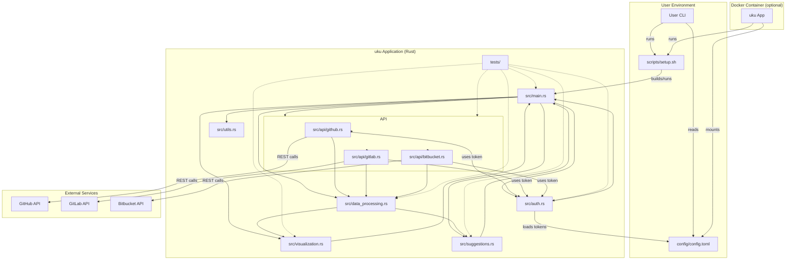
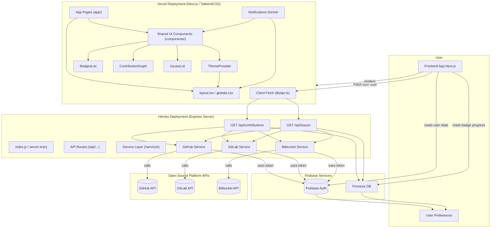

[](https://github.com/gongahkia/uku/releases/tag/1.0.0)
[](https://github.com/gongahkia/uku/releases/tag/2.0.0)

# `Uku`

Unified [CLI](./cli/) tool and [Web App](./web/uku-app) for aggregating, analyzing, and visualizing [open-source](https://en.wikipedia.org/wiki/Open-source_software) contributions *(streaks, badges, issues)* across [GitHub](https://github.com/), [GitLab](https://about.gitlab.com/), and [Bitbucket](https://bitbucket.org/product/).

Made mostly to practise [the stack](#stack).

## Stack

* *Script*: [Rust](https://www.rust-lang.org/), [Bash](https://www.gnu.org/software/bash/)
* *Frontend*: [React](https://react.dev/), [Next.js](https://nextjs.org/), [TypeScript](https://www.typescriptlang.org/)
* *Backend*: [Node.js](https://nodejs.org/en), [JavaScript](https://developer.mozilla.org/en-US/docs/Web/JavaScript)
* *DB*: [Firebase Realtime Database](https://firebase.google.com/docs/database)
* *Auth*: [PAT](https://en.wikipedia.org/wiki/Personal_access_token)
* *API*: [GitHub API](https://docs.github.com/en/rest), [GitLab API](https://docs.gitlab.com/api/rest/), [Bitbucket API](https://www.postman.com/api-evangelist/bitbucket/documentation/2aojru2/bitbucket)
* *Package*: [Docker](https://www.docker.com/)

## Usage

The below instructions are for running `Uku` on your client machine.

### CLI

1. Execute the below.

```console
$ git clone https://github.com/gongahkia/uku && cd uku/cli && chmod +x scripts/setup.sh
```

2. Place your [GitHub](https://github.com/), [GitLab](https://gitlab.com/) and [Bitbucket](https://bitbucket.org/product/) tokens within `./cli/config/config.toml`.

```toml
github_token = "XXX"
gitlab_token = "XXX"
bitbucket_token = "XXX"
```

3. Then run any of the following.

| Command | Purpose |
| :--- | :--- |
| `./scripts/setup.sh --github --show-streaks` | Show GitHub contributions |
| `./scripts/setup.sh --gitlab --show-badges` | Show GitLab contributions |
| `./scripts/setup.sh --bitbucket --show-streaks` | Show Bitbucket contributions |
| `./scripts/setup.sh --github --gitlab --bitbucket` | Aggregate all platform contributions |
| `./scripts/setup.sh suggest-issues` | List open issues |
| `cargo test` | Run all unit tests |
| `cargo test --test <test_file_name>` | Run specific test files |

4. Optionally build `Uku` as a [Docker Image](./Dockerfile) by running the following.

```console
$ docker build -t uku .
```

### Web App

1. Execute the below.

```console
$ git clone https://github.com/gongahkia/uku && cd uku/web/uku-app && npm i
```

2. Place your [GitHub](https://github.com/), [GitLab](https://gitlab.com/) and [Bitbucket](https://bitbucket.org/product/) tokens within `./web/uku-app/.env.local`.

```env
NEXT_PUBLIC_API_URL=http://localhost:3001
NEXT_PUBLIC_OAUTH_GITHUB_CLIENT_ID=XXX
NEXT_PUBLIC_OAUTH_GITLAB_CLIENT_ID=XXX
NEXT_PUBLIC_OAUTH_BITBUCKET_CLIENT_ID=XXX

NEXT_PUBLIC_APP_NAME=Uku
NEXT_PUBLIC_APP_DESCRIPTION="Unified Open-Source Contribution Aggregator"
```

3. Then build `Uku` by running the below.

```console
$ cd web
$ docker build -t uku-web . && docker run -p 3000:3000 uku-web
```

## Architecture

### CLI



### Web App



## Reference

The name `Uku` is in reference to [Ukuleleman](https://space-dandy.fandom.com/wiki/Ukuleleman), an alien who freezes people into smiling statues with his ukulele. Ukuleleman first makes an appearance in the episode [There's Music in the Darkness, Baby](https://space-dandy.fandom.com/wiki/There%27s_Music_in_the_Darkness,_Baby) of the anime [Space Dandy](https://space-dandy.fandom.com/wiki/Space_Dandy_(anime)).

